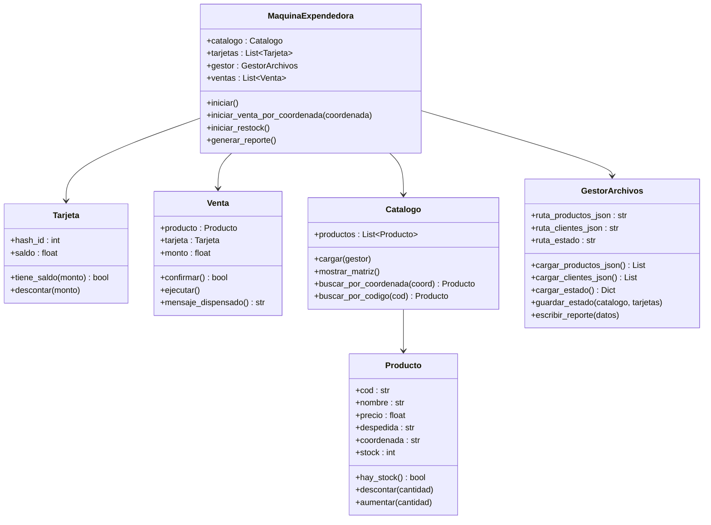

# Sistema de Máquina Expendedora Corporativa Inteligente

Este proyecto implementa un simulador de **Máquina Expendedora Corporativa** robusto, flexible e interactivo, desarrollado en Python bajo el paradigma de **Programación Orientada a Objetos (POO)**. Permite a los usuarios realizar compras seguras usando tarjetas de prepago y a los administradores gestionar existencias, modificar productos y generar informes analíticos de ventas.

---

## Autores

*  **Enrique Siracusa**
*  **Miguel Requena**

---

## Características Principales

*   **Arquitectura Modular POO**: Estructurado con clases bien definidas (`Producto`, `Tarjeta`, `Venta`, `Catalogo`, `MaquinaExpendedora` y `GestorArchivos`) que interactúan mediante encapsulamiento estricto.
*   **Persistencia de Estado**: El sistema guarda dinámicamente el stock y el saldo de las tarjetas de prepago en `estado_maquina.json`, de manera que los cambios no se pierdan al apagar la máquina.
*   **Tablero Alfanumérico Auto-Expandible**: La máquina dibuja en consola una matriz interactiva (de la columna `A` a la `Z` y filas del `1` al `6`). Soporta la incorporación ilimitada de nuevos carriles de venta (ej. columnas como la `I` o superiores) de manera automática.
*   **Seguridad Transaccional**: Incorpora validación de saldo prepagado y mecanismos de seguridad de tokens de tarjeta basados en hashes persistentes.
*   **Control Administrativo Dinámico**: Menú de operador seguro para reabastecer productos, habilitar nuevos carriles, modificar características de un producto o emitir reportes de ventas consolidados.

---

## Estructura del Proyecto

El código está estructurado bajo las mejores prácticas de modularización en Python:

```plaintext
Proyecto_Algoritmos/
│
├── src/
│   ├── controllers/
│   │   ├── __init__.py
│   │   ├── maquina_expendedora.py  # Controlador maestro del ciclo de vida y eventos
│   │   └── venta.py               # Orquestación transaccional de cada compra
│   │
│   ├── models/
│   │   ├── __init__.py
│   │   ├── producto.py            # Atributos y lógica de stock del producto
│   │   └── tarjeta.py             # Registro de saldo y hash criptográfico
│   │
│   ├── utils/
│   │   ├── __init__.py
│   │   └── gestor_archivos.py     # Manejo I/O de archivos JSON y reporte de texto
│   │
│   └── views/
│       ├── __init__.py
│       └── catalogo.py            # Representación visual y búsquedas en matriz
│
├── clientes.json                  # Base de datos inicial de tarjetas de prepago
├── productos.json                 # Catálogo base de productos
├── estado_maquina.json            # Archivo de persistencia de estado actual
├── reporte.txt                    # Reporte financiero autogenerado
└── Proyecto Enrique Siracusa y Miguel Requena.py # Script de entrada principal del proyecto
```

---

## Arquitectura del Software

A continuación se muestra el diagrama de clases que detalla las relaciones del sistema:



---

## Instrucciones de Ejecución

### 1. Requisitos Previos
*   Python 3.14.6 instalado en el sistema.

### 2. Arrancar la Aplicación
Ejecuta el archivo principal desde tu consola de comandos en el directorio raíz:
```bash
python "Proyecto Enrique Siracusa y Miguel Requena.py"
```
*(El script incluye un parche de compatibilidad para asegurar que `PYTHONHASHSEED` se configure en `0` de manera determinista al arrancar en Windows).*

### 3. Explicación del Hasheo y Compatibilidad de Versión
*   **Mecanismo de Hasheo**: Cuando el cliente ingresa un número de tarjeta (ej: `"1234567890"`), el sistema calcula su identificador aplicando la función `hash()` nativa de Python sobre la cadena. Para evitar discrepancias de signo y asegurar compatibilidad de 64 bits multiplataforma, se aplica la máscara de bits `& 0xffffffffffffffff` para forzar un entero sin signo.
*   **¿Por qué es obligatorio usar Python 3.14.6?**:
    1. **Semilla de Hash Determinista**: Python por defecto aleatoriza la semilla de hash en cada arranque por seguridad. El script principal fuerza `PYTHONHASHSEED=0` para mantener la consistencia en el cálculo.
    2. **Variabilidad entre Versiones**: El algoritmo interno de hash para strings en Python (SipHash y su implementación) cambia entre versiones mayores y menores del intérprete. Los identificadores cargados en [clientes.json](file:///c:/Users/Enrique/Desktop/Proyecto_Algoritmos/clientes.json) (como `971972920886152672` para `"1234567890"`) fueron generados y validados específicamente bajo **Python 3.14.6**.
    3. **Impacto**: Si se ejecuta el proyecto en cualquier otra versión de Python (ej: 3.10 o 3.12), la función `hash("1234567890") & 0xffffffffffffffff` resultará en un valor completamente distinto, lo que impedirá que las tarjetas coincidan con la base de datos de clientes, rechazando todas las compras.

---

## Guía de Operación y Comandos

### Interfaz Limpia y Flujo de Navegación
*   **Limpieza de Pantalla**: El sistema limpia automáticamente el terminal (`cls`/`clear`) al arrancar, al redibujar el menú principal y al moverse entre pantallas administrativas, garantizando una interfaz visual libre de ruido y comandos anteriores.
*   **Retorno Automático de Ventas**: Una vez confirmada o cancelada la venta, la máquina regresa de forma automática e instantánea al menú principal de compras (sin pausar la terminal), mostrando el resultado de la transacción (`[Dispensado] ¡Éxito! ...` o `[Cancelado] ...`) en la cabecera superior del menú.
*   **Catálogo Permanente en Administración**: Al ingresar al menú administrativo (`RS`), la cuadrícula de productos del catálogo se visualiza de manera permanente en cada pantalla y submenú, facilitando el control visual para el reabastecimiento y modificaciones de inventario.

### Modo Cliente (Compras)
*   **Seleccionar Producto**: Introduce la coordenada visible en el tablero (ej. `A2`, `B4`, `I1`).
*   **Pagar**: Ingresa tu número de tarjeta prepago de prueba (ej. `1234567890`).
*   **Confirmar**: Confirma la compra con `S` (o presiona **Enter** vacío para cancelar la compra y regresar al menú).

### Modo Administrador / Operador
Escribe `RS` o `RESTOCK` en el prompt principal. Ingresa la clave de administrador (`admin123`).

*   **Menú General de Administración**:
    *   `1. Reabastecer o agregar producto`
    *   `2. Cambiar Producto`
    *   *Presiona **Enter** vacío para regresar al menú principal de la máquina.*
*   **Menú de Reabastecimiento**:
    *   `1. Reabastecer un producto existente`: Incrementa el stock de un carril. Soporta entrada por código (ej. `CocaC`) o por coordenadas (`A1`). Si el producto se quedó sin coordenadas por no estar en la matriz original, se le reasignará su posición por defecto si está vacía.
    *   `2. Habilitar nuevo carril de producto`: Configura un nuevo producto en una nueva coordenada (ej. `I4`), expandiendo la matriz dinámicamente.
    *   *Presiona **Enter** vacío para regresar al menú de administración general.*

### Métricas y Reportes
Escribe `RP` o `REPORTE` en el prompt principal e introduce la contraseña de administrador (`admin123`). El sistema generará e imprimirá un archivo de texto llamado `reporte.txt` con la recaudación del día, ventas por usuario, total recaudado y el producto más vendido.
*(Este reporte también se genera de forma automática al apagar el sistema con el comando `SALIR`)*.
